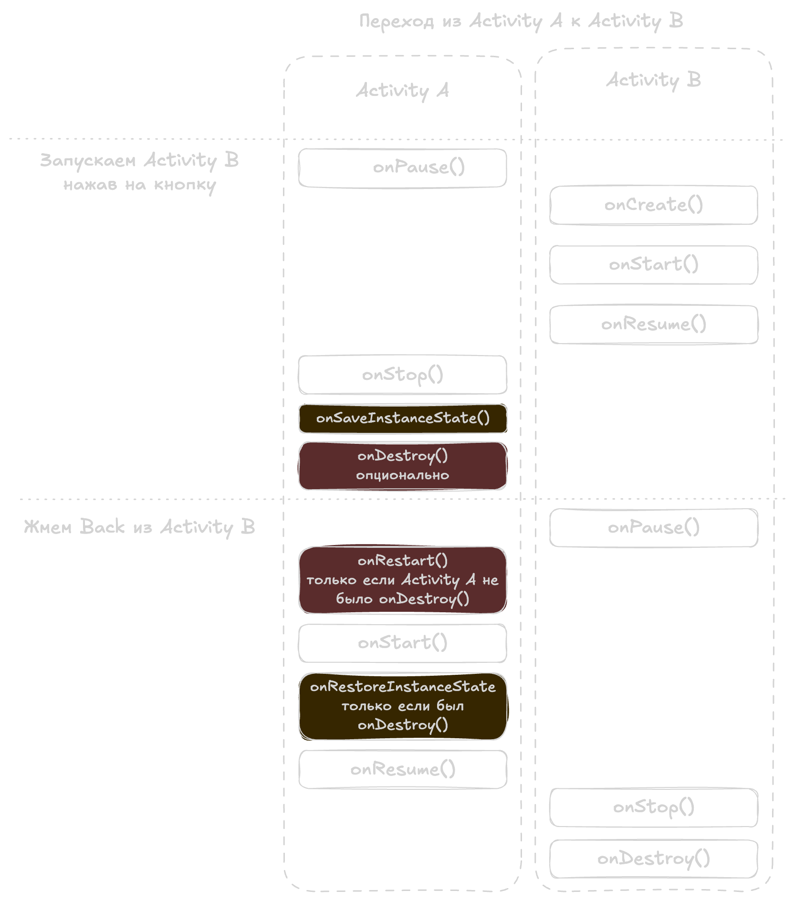
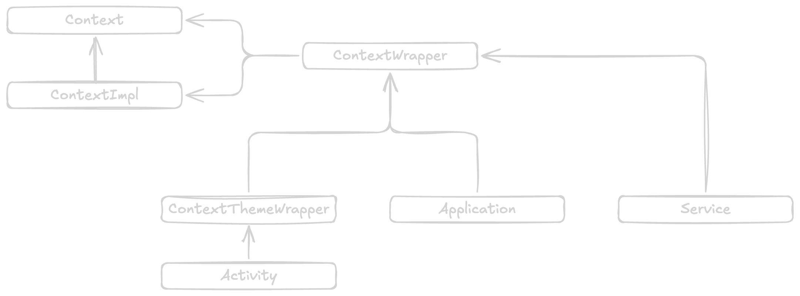

# Android SDK

## Снаружи
- [View](./view.md)
- [Parcelable](./parcelable.md)
- [Рендеринг](./rendering.md)
- [Android internals](./internal.md)

## Компоненты
- [Activities](#activity)
- [Services](#service)
- [Broadcast receivers](#broadcastreceiver)
- [Content providers](#contentprovider)

## Песочница
- [Context](#context)
- [Application](#application)

- [The manifest file](#manifest)
- [Fragment](#fragment)
- [Bundle]()
- [Intent]()
- [Сохранение состояния]()
- [Запуск приложения](#application-launch)
- [Binder IPC](#binder-ipc)

### Activity

Метод `onStart()` - активити становится видимой
Метод `onResume()` - можно взаимодействовать

taskAffinity — это строковая метка, по которой Android решает в какой task поместить Activity 
по умолчанию affinity = имя пакета приложения

Launch modes

standard - создает новый инстанс в том же таске, можно много инстансов

singleTop - может иметь несколько инстансов в одной или нескольких таска, 
однако если уже есть инстанс с топе таски то вместо создания новой активити 
будет вызван onNewIntent()

singleTask - создаст активити в новой таске как root. 
помогает когда необходимо иметь только один инстанс активити для таска
учитывает taskAffinity, по этому можно создать несколько штук в разных тасках с отличными taskAffinity
если при запуске найден существующий экземпляр, то стек до него будет очищен, а у найденного активити
будет вызван onNewIntent()

singleInstance - поведение как singleTask только в таск больше нельзя добавить никакой экран
любой старт активити будет запущен в новой таске
Если при старте в приложении уже существует инстанс такого активити, 
то у него будет вызван onNewIntent()
Создать два экземпляра такого активити ен получится даже с разными taskAffinity

singleInstancePerTask - создаст активити в новой таске как root
В таске может быть только один экземпляр такой активити.
очищает стек до существующего активити
можно создать несколько инстансов в разных тасках используя 
специальные флаги `FLAG_ACTIVITY_MULTIPLE_TASK` или `FLAG_ACTIVITY_NEW_DOCUMENT`

Intent flags - меняем стандартное поведение запуска

FLAG_ACTIVITY_NEW_TASK
- Запускает Activity в новом task.
- Если task с такой Activity уже есть → помещает его на передний план.
- Существующая Activity получает intent через onNewIntent().
- Учитывает taskAffinity

FLAG_ACTIVITY_SINGLE_TOP
- Если Activity уже на вершине стека → не создаётся новый экземпляр.
- Новый intent приходит в onNewIntent().
- Если Activity не на вершине → создаётся новый экземпляр.

FLAG_ACTIVITY_CLEAR_TOP
- Если Activity уже есть в текущем task:
  - уничтожает все Activity выше неё в стеке
  - доставляет intent через onNewIntent()
- Если у Activity launchMode = standard:
  - старая Activity тоже будет удалена
  - создаётся новая Activity, потому что standard всегда создаёт новый экземпляр для нового intent’а.

FLAG_ACTIVITY_CLEAR_TASK
Обычно работает с связке с FLAG_ACTIVITY_NEW_TASK
Находит таск с инстансом нашей активити, 
если не находит стартует новый таск с root activity
если находит, удаляет все активити в таске

ЖЦ

Метод `onSaveInstanceState()` вызывается после `onStop()` всегда,
потому что в будущем activity может быть убита системой,
например из-за нехватки памяти или приоритета фоновых процессов.

Если вызвать `finish()` в `onCreate()` то `onPause()` и `onStop()` не будут вызваны, вызовет только `onDestroy()`.

#### Переход из A -> B -> click back




### Service

### BroadcastReceiver

### ContentProvider


### Установка МП
При установке приложения ему присваивается Linux User ID.
Что даст приложению возможность запускаться в собственном экземпляре Android Runtime (ART).
Таким образом все его ресурсы не будут доступны другим приложениям
Но и самому приложению недоступны ни ресурсы, ни запуск основных компонентов андроид из кода
Для этого приложению нужен контекст
Вообще для работы компонентов нежен и контекст и манифест

Манифест сообщает системе андроид о наличии приложения,
разрешениях для этого приложения
и наличии компонентов приложения

### Permissions

Permissions — это механизм безопасности Android, который:

- ограничивает доступ к чувствительным данным (contacts, location и т.д.)
- ограничивает доступ к опасным действиям (camera, microphone и т.д.)

[Все Manifest.permission](https://developer.android.com/reference/android/Manifest.permission)

####  🟢 install-time permissions
- Выдаются при установке автоматически
- Минимальный риск

▪️ Normal
- Не влияют на privacy сильно
- Пример: INTERNET

▪️ Signature
- Только если приложение подписано тем же сертификатом
- Используется системными app

В Android есть несколько подтипов _install-time permissions_, в том числе _normal permissions_ и _signature
permissions_.

## Что исследовать
один и тот же объект для парселабла или сериализации при передаче через интент

ограниения bundle

передача ссылочных типов через intent и bundle

жц вью, методы, инвалидейт, и реквест лейаут, viewgroup и ее особенности

жц фрагментов, разница иинициализации

можно ли поменять размер вью без layoutparams через width и heigth

RecyclerView ListView ViewHolders и как сделать эффективные списки

https://developer.android.com/reference/androidx/recyclerview/widget/DiffUtil.Callback

Коллекции android sdk

Материалы:
- [Digging Into Android System Services](https://www.youtube.com/watch?v=M6extgmQQNw)
- [Context in Android - A Deep Dive](https://www.youtube.com/watch?v=S22NlX4iXJU)

Android sandbox — это механизм изоляции приложений, при котором каждое приложение работает в своём процессе и под своим UID, не имея прямого доступа к данным и памяти других приложений.

изоляция обеспечивается НЕ Android, а Linux kernel
Каждое приложение = отдельный Linux user и Отдельный процесс

Есть системный процесс system_server.
в нём живут реальные сервисы:

- ActivityManagerService
- WindowManagerService
- PackageManagerService

некоторые вынесены отдельно: (что бы при падении не порушить всю систему)
- media server (mediaserver / media.codec)
- cameraserver
- bluetooth


ServiceManager

ServiceManager — это центральный реестр Binder-сервисов в Android, 
который позволяет находить системные сервисы по имени.
Запускается при старте системы
МП не знает где находится нужный сервис, за это отвечает ServiceManager.

порядок примерно такой:
1. kernel
2. init
3. servicemanager
4. zygote
5. system_server

Он работает в отдельном процессе `servicemanager` (контексте binder driver), 
создаётся при старте системы и участвует в IPC как "directory service" 
для получения binder-объектов.

Сервисы регистрируются в ServiceManager под стринговым именем для поиска сервиса.
Когда стартует System Server при загрузке девайса, он создает экземпляры своих сервисов;
Так же он создает Stub (заглушки) для всех сервисов и передает из в ServiceManager 
где заглушки живут в виде IBinder.

приложения потом смогут так получить сервис (код из SystemServiceRegistry)
```java
IBinder b = ServiceManager.getServiceOrThrow(Context.ALARM_SERVICE);
IAlarmManager service = IAlarmManager.Stub.asInterface(b);
return new AlarmManager(service, ctx);
```

все зареганный сервисы можно посмотреть с помощью команды
```shell
  adb shell service list
```

вот пример:
- SurfaceFlinger: [android.ui.ISurfaceComposer]
- activity: [android.app.IActivityManager]
- activity_task: [android.app.IActivityTaskManager]


Сервис всегда один, однако в каждом приложении могут быть созданы многие инстансы менеджеров
Откуда бы мы не подучали менеджер, менеджер есть для каждого контекста, 
но под капотом все менеджеры используют один и тот же прокси (напр IAlarmManager)

Менеджер это по своей сути высокоуровневая абстракция, хотя по сути это просто класс,
делегирующий вызовы прокси. Менеджеры упрощают работу с другими процессами
делая работу похожей на синхронную, как будто мы работаем локально в своем приложении.

Компоненты андроид либо сами являются контекстом либо имеют доступ к контексу
Context->ContextImpl->SystemServiceRegistry

Когда процесс МП запускается, список сервисов статически создается внутри реестра, 
но сами объекты менеджеров не создаются. 
Создается фабричный метод для создания инстанса, который привязан к имени сервиса,
например `Context.ACTIVITY_SERVICE`, по которому мы и запрашиваем менеджер (сервис)

В каждом контексте есть свой SystemServiceRegistry, то есть в каждом активити или сервисе.

так как сервис и наше МП работают в разных процессах, нужен способ общения между ними и это Binder IPC.
Для упрощения общения приложения и сервиса генерируются Proxy (сторона МП) и Stub (сторона сервиса)
Предоставляют более дружественный API, нежели Binder

На основе одного интерфейса при сборке генерируются эти два компонента (Proxy+Stub).
Генерятся они с помощью AIDL (Android Interface Definition Language)

Разбор на примере AlarmManager:
- Класс AlarmManager содержит поле типа IAlarmManager который передается через конструктор и наш менеджер делегирует ему всю работу проксируя вызовы методов
- IAlarmManager и есть наш proxy и он работает с Binder
- IAlarmManager.Stub принимает вызовы от IAlarmManager через Binder
- AlarmManager так же имеет заглушку для IAlarmListener.Stub который хранится в поле типа WeakHashMap

Через Binder один процесс, например наше МП может отправить объект в другой процесс, например сервис.
Binder преобразует объект для перемещения между процессами и затем соберет его для получения другим процессом
Что бы обеспечить согласованность (consistency) Binder удерживает объект сильной ссылкой
И пока служба имеет доступ к нашему объекту, GC не сможет собрать его.
По этому не стоит передавать долгоживущие объекты типа контекста в сервис, например как имплементацию слушателя
Пока GC не очистит ссылку на переданный объект в процессе SystemServices, объект не будет удален.
Системные службы запускают GC не так уж часто
Например для работы LocationManager нужен LocationListener и если наша Activity будет его имплементить 
и мы передадим ссылку на Activity в LocationManager.requestLocationUpdates(LocationManager.GPS_PROVIDER, 0, 0, <Наша активити>);
то даже если мы удалим слушатель LocationManager.removeUpdates(<Наша активити>) в Activity.onPause,
это не значит что наша ссылка на активити будет удалена GC 
и если мы финишируем нашу активности, то активити может утечь, это легко проверить сделав дамп кучи через профайлер.
решается передачей простого объекта вместо активити.


```java
registerService(Context.ACTIVITY_SERVICE, ActivityManager.class,
        new CachedServiceFetcher<ActivityManager>() {
    @Override
    public ActivityManager createService(ContextImpl ctx) {
        return new ActivityManager(ctx.getOuterContext(), ctx.mMainThread.getHandler());
    }});

registerService(Context.ALARM_SERVICE, AlarmManager.class,
                new CachedServiceFetcher<AlarmManager>() {
    @Override
    public AlarmManager createService(ContextImpl ctx) throws ServiceNotFoundException {
        IBinder b = ServiceManager.getServiceOrThrow(Context.ALARM_SERVICE);
        IAlarmManager service = IAlarmManager.Stub.asInterface(b);
        return new AlarmManager(service, ctx);
    }});
```


Activity->ContextThemeWrapper->ContextWrapper->Context

Реестр это лениво загружаемый кеш объектов менеджеров
кеш для каждого контекста а не для приложения, то есть вызовы getSystemService из разных контекстов создают новые экземпляры одного и того же сервиса

context.getSystemService(Context.CLIPBOARD_SERVICE) as ClipboardManager

### [Context](https://developer.android.com/reference/android/content/Context)
```java
public abstract class Context extends Object {}
```
Контекст в андроид это по сути ключ или пропуск 
который приложение предоставляет системе что бы она выполнила действие от нашего имени
это может быть как одно из взаимодействий с собственными компонентами
так и получения доступа в системным сервисам
??? так и для взаимодействия с другими приложениями ???

ActivityThread создает ContextImpl
Мы получаем его с помощью вызова `ContextWrapper.attachBaseContext(Context base)`


Context абстрактный класс 
ContextImpl реализует все абстрактные методы Context
ContextWrapper наследуется от Context но не реализует его, а использует ContextImpl
ContextThemeWrapper нужен только для активити, так как другим сущностям не нужна тема (у них нет UI)

ApplicationContext - это глобальный контекст
context.getApplicationContext()
activity.getApplication()

BaseContext это исходный ContextImpl

Activity Context ограничен ЖЦ экрана, имеет свою тему




### Application
Application : ContextWrapper : Context

### Manifest

### Fragment
(https://github.com/fylmr/android-interview?tab=readme-ov-file#fragments)

### Application Launch

Материалы:
- [Схема запуска](./images/app-launch.webp)
- [Android App Launch: A Deep Dive](https://kitemetric.com/blogs/android-app-launch-a-deep-dive)
- [Inside Android: Context, Binder IPC, Zygote - Ioannis Anifantakis | droidcon Berlin 2025](https://youtu.be/AXUu-_fEyD0?si=Z4xQKhbKJTaFflsD)


#### Launcher
- Launcher отправляет Intent (с ACTION_MAIN, CATEGORY_LAUNCHER) в AMS используя Binder IPC (Inter-Process Communication).

#### ActivityManagerService

AMS запрашивает у PMS (PackageManagerService) информацию о приложении
(манифест, точка входа — Activity с фильтром CATEGORY_LAUNCHER).

Если процесс приложения уже существует: 
- AMS находит его запись (ProcessRecord)
- выводит его root Activity в foreground (Resume) 
- передает сохраненный Bundle (если есть) в onCreate() / onRestoreInstanceState() 

Если процесса нет:
- Fork от Zygote: AMS отправляет запрос Zygote используя socket message на создание нового процесса (fork()).
- Инициализация процесса: В новом процессе запускается ZygoteInit.main(), инициализирующая среду выполнения (ART/Dalvik).
- Создание главного потока: Создается main (UI) thread.
- Запуск ActivityThread: Вызывается main() метод ActivityThread — «сердце» приложения.
- Привязка к AMS: ActivityThread.attach() связывает процесс приложения с AMS через Binder, регистрируя новый ApplicationThread (Binder‑интерфейс приложения для AMS).
- Инициализация Looper/Handler: Создаются Looper (обработка очереди сообщений) и Handler (обработка сообщений, вызов методов жизненного цикла) для главного потока.
- Создание Application: AMS инициирует создание объекта Application (вызов onCreate()).
- Создание Launch Activity:
  - ActivityTaskManager (часть AMS) получает команду создать Activity.
  - ActivityStarter обрабатывает запрос.
  - AMS отправляет транзакцию приложению (через ApplicationThread) на создание Activity.
- Обработка в ActivityThread: Полученная транзакция (ClientTransaction) обрабатывается. Через Instrumentation создается экземпляр Activity.
- Жизненный цикл Activity: Вызываются onCreate() → onStart() → onResume()(передача сохраненного Bundle в onCreate() при восстановлении). UI отображается пользователю.


- App Status Check: 
- It verifies if the app is already running. If so, it brings it to the foreground.
- Process Existence: 
- Otherwise, it checks if the app's process exists.
- Process Creation: 
- If not, AMS instructs Zygote to create a new process for the app.

#### 3. Zygote: The Efficient Process Factory
   Zygote, a crucial system process, optimizes app launching by:

- Request Handling: It receives the app launch request from AMS via a socket message.
- Forking: Instead of creating a process from scratch, Zygote forks itself, producing a quick, lightweight copy.
- ART Initialization: This new process prepares to load the app using the Android Runtime (ART).

#### 4. App Initialization: Android Runtime (ART) Takes Over
   With the app's process ready, ART manages:

- Resource Loading: It loads the app's code and resources into memory.
- Main Method Execution: The entry point, `ActivityThread.main()`, starts the main thread and event loop.
- Application Object Creation: The Application class, defined in `AndroidManifest.xml`, is instantiated, initiating its `onCreate()` method.

#### 5. Displaying the First Screen
   Finally, the app's initial activity is launched:

- AMS Instruction: AMS instructs the app process to start its initial activity.
- ActivityThread Handling: `ActivityThread` manages the activity's creation, executing lifecycle methods such as `onCreate()`, `onStart()`, and `onResume()`.
- UI Rendering: `ViewRootImpl` and `SurfaceFlinger` handle OpenGL rendering and display the UI on your screen, synchronized with the screen's refresh rate using Choreographer.

#### 6. Your App Appears!
   The final visual integration:

- UI Synchronization: The UI updates align with the screen's refresh rate.
- SurfaceFlinger Composition: `SurfaceFlinger` combines all visual elements and sends the final frame to your phone's display.
- App Launch Completion: Your app is now ready for use!

### Binder IPC

Материалы:
- [Binder - как устроена работа с несколькими процессами в Android](https://www.youtube.com/watch?v=yyaw0C6oA5k)

ЖЦ процесса
New → Ready → Running → Waiting → Terminated

С помощью команды можно посмотреть все запущенные процессы.
```shell
    adb shell ps
```

Мы сможем увидеть юзера процесса, его PID, ID процесса родителя и тд.
Имя процесса это имя пакета приложения

Activity Manager дает команду на создание процесса
Zygote форкает себя, создается новый процесс
Создается Activity Thread
Создается Application, вызывается onCreate()

По умолчанию каждое МП запускается в своем процессе.

Можно запустить несколько МП в одном процессе, для этого нужно доработать манифесты приложений и подписать приложения одним ключом.
С Андроида 10 это задепрекейтили.

Можно запускать каждый компонент приложения в отдельном процессе.
В таком случае инстанс нашего Application будет создан для каждого процесса

Мы можем передавать данные через Intent для общения между компонентами.
Intent содержит в себе Bundle

В Bundle можно положить разные данные
Простые типы, Serializable, Parcelable
Отправка интента асинхронная

ResultReceiver:Parcelable - callback, который можно передать через Bundle для получения результата из другого компонента/процесса

```kotlin
private val receiver = object : ResultReceiver(Handler(Looper.getMainLooper())) {
    override fun onReceiveResult(resultCode: Int, resultData: Bundle?) {
        // Если не указали Handler выполнится в Binder thread, а не UI thread
        val data = resultData?.getString("data")
        Log.d("RESULT", "Got: $data")
    }
}

// где-то в другом компоненте/процессе
val receiver = intent?.getParcelableExtra<ResultReceiver>("receiver")
val result = Bundle().apply {
    putString("data", "Hello from Service")
}
receiver?.send(1, result)
```

Можно передавать данные между приложениями/процессами через ContentProvider
Методы CP могут вызываться на разных потоках и клиенту нужно менеджить синхронизацию

Еще для передачи данных есть Messenger, поддерживает передачу Parcelable объектов

Binder - быстрый механизм RPC (Remote Procedure Call — удаленный вызов процедур)
Все сообщения передаются через транзакции
Транзакции обрабатываются пулом потоков Binder
Binder Framework на уровне Kernel передает данные от клиента серверу

для доступа разработчикам есть интерфейс IBinder
у него есть метод transact, который возвращает успешно или нет прошла транзакция
```java
public boolean transact(
        int code, // идентификатор метода
        @NonNull Parcel data, // что передаем
        @Nullable Parcel reply, // куда записываем ответ
        int flags // синхронный или асинхронный вызов
) throws RemoteException;
```

на серверной части вызывается onTransact с аналогичной сигнатурой

В транзакциях используется Parcel, поддерживает простые типы данных и массивы. 
Что бы мы могли пересылать кастомные объекты, мы реализуем Parcelable у класса.

AIDL
В интерфейсах для передачи можно использовать:
- простые типы и их массивы
- String, CharSequence
- FileDescriptor
- Serializable
- Bundle
- List
- SparseArray и др
- IBinder, IInterface
- Parcelable

После создания интерфейса и сборки модуля будут сгенерены proxy и stub файлы

Что бы вызвать метод интефейса, нам нужно создать ServiceConnection и перегрузить
методы 

```kotlin
var proxy: ICalculator? = null

fun onServiceConnected(name: ComponentName?, service: IBinder?) {
    proxy = ICalculator.Stub.asInterface(service)
}

fun onServiceDisconnected(name: ComponentName?) {
    proxy = null
}
```

Когда мы отправляем что-то через Binder, происходит маршалинг данных:
Создается Parcel, в него записывается мета-информация и данные
Данные проходят границу процессов
На Binder thread pool происходит анмаршалинг данных в коде нашего Stub
После выполнения данные снова маршеляца что бы уйти обратно в клиент
Затем на клиенте происходит анмаршалинг данных из reply: Parcel

Parcel.cpp
Ничего не знает о типах данных и оперирует только байтами
За счет этого достигается скорость
По сути когда мы пишем в Parcel мы указываем сколько байт записать и контент, потом указатель смещается
По этому важен порядок записи и чтения

Даже если мы в рамках одного процесса открываем из активити другое, 
идет обращение в Binder.

При запуске Activity вызов проходит через Instrumentation, 
затем через Binder отправляется в ActivityTaskManagerService в system_server, 
где принимается решение о запуске. 

После этого через Binder вызывается ApplicationThread в приложении, 
и ActivityThread на главном потоке создаёт Activity 
и вызывает её lifecycle методы. 

Binder используется даже если Activity запускается в том же процессе.

```
Activity.startActivity()
↓
Instrumentation.execStartActivity()
↓
Binder → ATMS (system_server)
↓
ActivityStarter / Task management
↓
Binder → ApplicationThread (app)
↓
ActivityThread (main thread)
↓
performLaunchActivity()
↓
Instrumentation.callActivityOnCreate()
↓
Activity B.onCreate()
```
