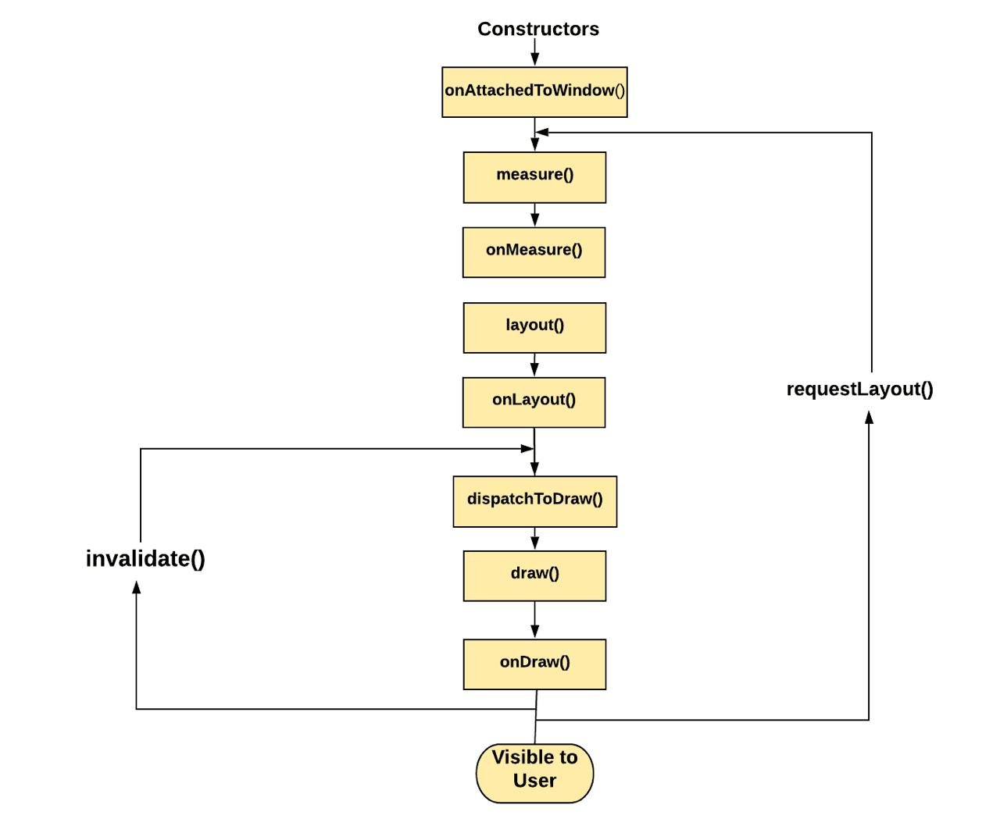

# View

### Permissions

Permissions — это механизм безопасности Android, который:

- ограничивает доступ к чувствительным данным (contacts, location и т.д.)
- ограничивает доступ к опасным действиям (camera, microphone и т.д.)

[Все Manifest.permission](https://developer.android.com/reference/android/Manifest.permission)

####  🟢 install-time permissions
- Выдаются при установке автоматически
- Минимальный риск

▪️ Normal
- Не влияют на privacy сильно
- Пример: INTERNET

▪️ Signature
- Только если приложение подписано тем же сертификатом
- Используется системными app

В Android есть несколько подтипов _install-time permissions_, в том числе _normal permissions_ и _signature
permissions_.

#### 🔴 runtime permissions (Dangerous)

#### special permissions

### Lifecycle

