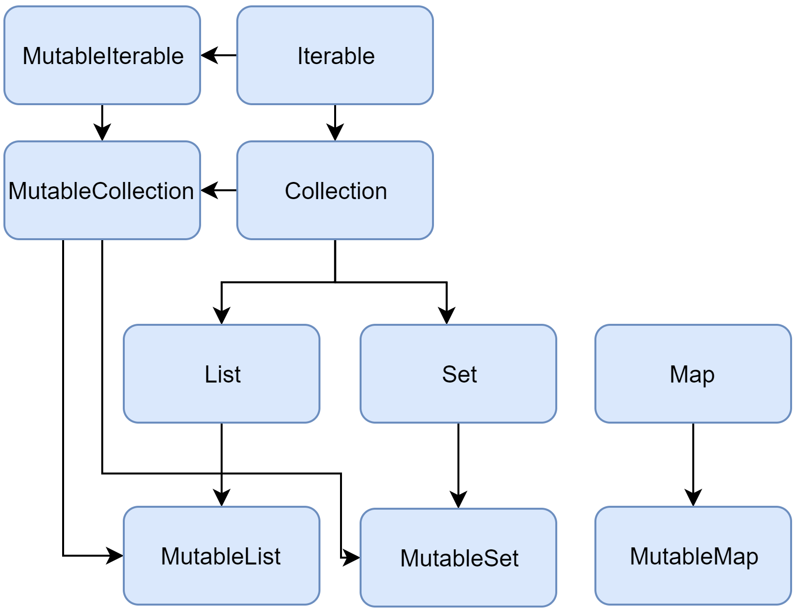

# Коллекции Kotlin

- [List, Map, Set](#база)
- [ArrayDeque](#arraydeque)
- [Создание коллекций](#создание-коллекций)
- [Sequences](#sequences)

### База

Коллекции в Kotlin делятся на мутабельные и неизменяемые (Read-only).

Read-only типы коллекций, являются ковариантными.
Mutable коллекции являются инвариантными. 
Это означает, что если класс `Rectangle` наследуется от `Shape`,
то вы можете использовать `List<Rectangle>` везде, где требуется `List<Shape>`.
Другими словами, типы коллекций подчиняются тем же правилам наследования, что и типы элементов.

`Map` являются ковариантными по типу значения, но не по типу ключа.
`MutableMap` инварианты и по ключу и по значению.




- В Kotlin для реализации `MutableList` используется `ArrayList`
- `MutableSet` по умолчанию `LinkedHashSet` и сохраняет порядок добавления элементов
- `MutableMap` по умолчанию `LinkedHashMap` и сохраняет порядок вставки элементов при итерации по Map 

### ArrayDeque

`ArrayDeque<T>` — это реализация двусторонней очереди, 
которая позволяет добавлять или удалять элементы как в начале, так и в конце очереди. 

`ArrayDeque` может выступать и как Stack, и как Queue. 

В основе `ArrayDeque` лежит изменяемый массив, размер которого автоматически корректируется при необходимости.

### Создание коллекций

- listOf(1, 2, 3)
- mutableListOf<T>()


- setOf("one", "two", "three", "four")
- mutableSetOf<T>()

```kotlin
val numbersMap = mapOf("key1" to 1, "key2" to 2, "key3" to 3, "key4" to 1)

val numbersMap = mutableMapOf<String, String>()
    .apply { this["one"] = "1"; this["two"] = "2" }
```

Так же создать коллекцию можно используя builder function:
- buildList()
- buildSet()
- buildMap() 

```kotlin
val x = listOf('b', 'c')

val y = buildList() {
    add('a')
    addAll(x)
    add('d')
}

println(y) // [a, b, c, d] 

val x = setOf('a', 'b')

val y = buildSet(x.size + 2) {
    add('b')
    addAll(x)
    add('c')
}

println(y) // [b, a, c] 

val map = buildMap { // this is MutableMap<String, Int>, types of key and value are inferred from the `put()` calls below
    put("a", 1)
    put("b", 0)
    put("c", 4)
}

println(map) // {a=1, b=0, c=4}
```

Функция инициализации для List и MutableList

```kotlin
val doubled = List(3, { it * 2 })
println(doubled) // [0, 2, 4]
```

Функции копирования создают shallow копии коллекций:
- [`toList()`](https://kotlinlang.org/api/latest/jvm/stdlib/kotlin.collections/to-list.html)
- [`toMutableList()`](https://kotlinlang.org/api/latest/jvm/stdlib/kotlin.collections/to-mutable-list.html)
- [`toSet()`](https://kotlinlang.org/api/latest/jvm/stdlib/kotlin.collections/to-set.html)
 
Создают snapshot коллекции на определенный момент. 
В результате получается новая коллекция с теми же элементами. 
Если вы добавите или удалите элементы из исходной коллекции, 
это не повлияет на копии. Копии также можно изменять независимо от источника.

### [Sequences](https://kotlinlang.org/docs/sequences.html)

- Последовательности не содержат элементов, а генерируют их во время итерации.
- Выполняют многоэтапную обработку лениво, что повышает производительность.
- Порядок выполнения операций отличается от коллекций: каждый элемент обрабатывается по очереди.

Операции над последовательностями бывают: 
- Stateless операции не требуют наличия state и обрабатывают каждый элемент независимо, например `map()` или `filter()`. Может требовать небольшой постоянный объем памяти, например для `take()` или `drop()`.
- Stateful операции требуют значительного объема данных, обычно O(n).

👉 state (состояние) — это данные, которые операция должна хранить между обработкой элементов.
То есть не просто обработать элемент, а что-то запомнить.

| Операция | Тип              | Память |
| -------- | ---------------- | ------ |
| map      | stateless        | O(1)   |
| filter   | stateless        | O(1)   |
| take     | stateful (small) | O(1)   |
| drop     | stateful (small) | O(1)   |
| distinct | stateful         | O(n)   |
| sorted   | stateful         | O(n)   |

🔷 Stateless operations
```kotlin
map { }
filter { }
```
👉 Почему они stateless?

Потому что:

➡️ каждый элемент обрабатывается независимо

➡️ ничего не нужно помнить о предыдущих элементах

Пример: Для числа 2 не важно, что было до него
```kotlin
sequenceOf(1, 2, 3).map { it * 2 }
```

🟢 Small constant amount of state

👉 фиксированное количество памяти

👉 не зависит от размера коллекции

Что нужно хранить?

👉 только счётчик. O(1) memory

Пример:
```kotlin
sequenceOf(1, 2, 3, 4, 5).take(3)
```

🔴 Stateful operations O(n)

Пример:
```kotlin
sequenceOf(1, 2, 2, 3).distinct()
```

Что нужно хранить?

👉 все уже встреченные элементы


